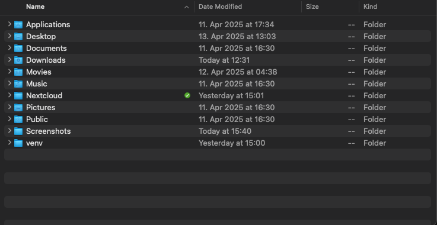
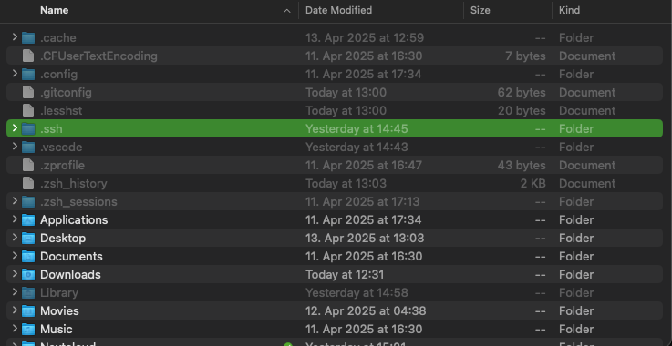
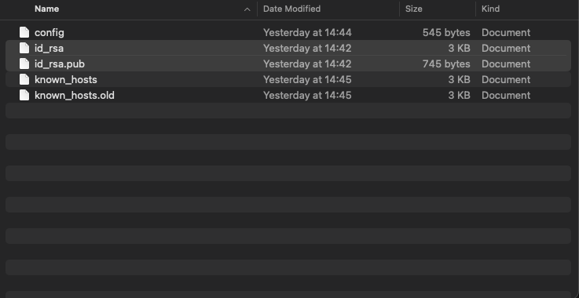

---
date:
    created: 2025-04-18
    updated: 2025-04-21
tags:
    - ssh
---

# SSH Key aktivieren

Wenn man einen SSH Key hat den man auf einem neuen System wieder aktivieren möchte, müssen folgenden Schritte gemacht werden.

Vorhandene Dateien ==id_rsa.pub== und ==id_rsa== in den ==.ssh== Ordner kopieren.

Auf einem Mac System ist dieser Ordner per default nicht sichtbar, mit der  Tastenkombination ++command+shift+period++ werden die versteckten Dateien und Order eingeblendet.





Wenn der Ordern '.ssh' nicht vorhanden ist, kann er einfach erstellt werden. Wichtig hierbei ist das der ==.== mit im Ordernamen angegeben wird.

Der Ordner kann wie hier im Beispiel auch schon Dateien wie 'config' oder 'known_hosts' enthalten.



Nachdem die Dateen in den Ordner kopiert wurden, müssen noch die entsprechenden Rechte gesetzt werden, dieses erfolgt im Terminal.

```shell title="Public Key"
chmod 644 ~/.ssh/id_rsa.pub
```

```shell title="Privat Key"
chmod 600 ~/.ssh/id_rsa
```

```shell title="Ordner"
chmod 700 ~/.ssh
```
